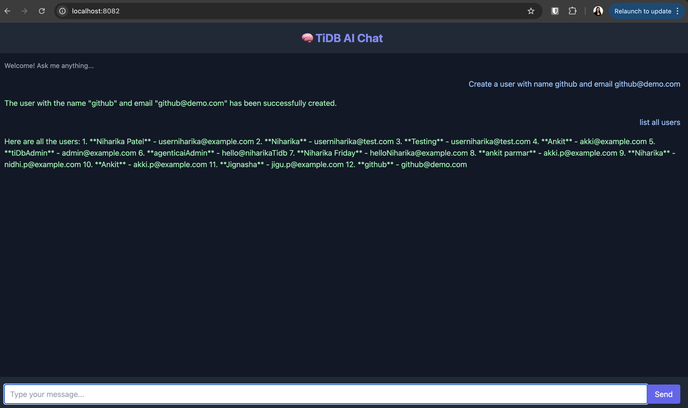

# Agentic TiDB CRUD Example

>This is a Spring Boot project that demonstrates CRUD operations using TiDB (a MySQL-compatible distributed database). 
The project integrates with OpenAI's GPT-4 model for AI-based functionalities and leverages the MCP `@Tool` framework to enable agentic capabilities.


## Features
- Agentic capabilities with MCP `@Tool`
- CRUD operations with TiDB
- Spring AI integration using OpenAI GPT-4 via Spring AI
- Spring Boot-based architecture
- Logging and debugging enabled for development
- Memory persistence using JDBC-based chat history

## Prerequisites
- Java 17 or higher
- Maven 3.6 or higher
- TiDB Cloud account
- OpenAI API key

## User Interface Preview

## 🖼️ User Interface Preview

The app comes with a built-in chat interface for interacting with your AI agent and CRUD tools.  
File: [src/main/resources/templates/chat.html](src/main/resources/templates/chat.html)

### Chat UI Screenshot




## Setup Instructions

1. **Clone the Repository**
   ```bash
   git clone <repository-url>
   cd <repository-folder>
   ```

2. **Configure the Application**
   Update the `src/main/resources/application.properties` file with your TiDB and OpenAI credentials.
    ```
      spring.datasource.url=jdbc:mysql://<tidb-endpoint>/<database>?sslMode=VERIFY_IDENTITY
      spring.datasource.username=<username>
      spring.datasource.password=<password>
      spring.ai.openai.api-key=<your-openai-key>
      ```

3. **Build the Project**
   ```bash
   mvn clean install
   ```

4. **Run the Application**
   ```bash
   mvn spring-boot:run
   ```

5. **Access the Application**
   The application will be available at `http://localhost:8080`.

## Database Schema
The schema is initialized using the `schema-ai-memory.sql` file. 
Ensure the `spring.sql.init.mode` property is set to `always` in `application.properties`.
```
spring.sql.init.mode=always
```

## Testing
Run the tests using:
```bash
mvn test
```

## Logging
Logging is configured in `application.properties` for debugging purposes. Adjust the logging levels as needed.
```
logging.level.org.springframework.web=DEBUG
logging.level.org.springframework.ai=DEBUG
```

## Agentic Capabilities
This project uses the MCP `@Tool` framework to enable agentic functionalities. 
The `@Tool` annotations allow seamless integration with OpenAI's GPT-4 model, enabling advanced AI-driven operations.
```
Example:

@Tool(name = "createUser", description = "Creates a new user in the database")
public User createUser(String name, String email) {
    return repository.save(new User(name, email));
}
```
This allows GPT-4 to call real application methods to perform CRUD operations — effectively turning your backend into an agentic API.


